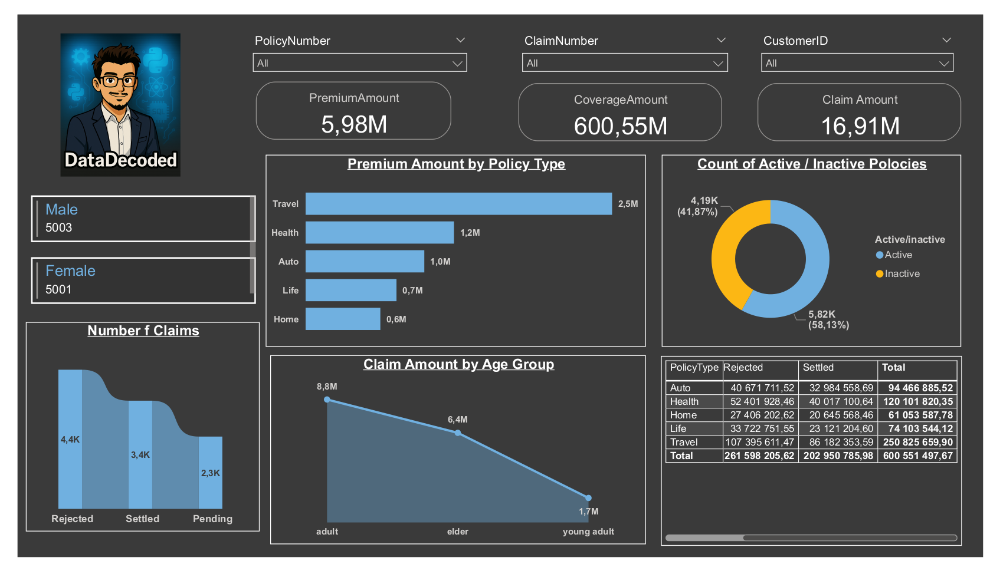

# 🏥 Insurance Claims Analysis Dashboard - Power BI

This project presents a professional analysis of insurance claims using Power BI.

---

## 🔍 Overview

The dataset represents historical insurance claims including information on:
- Policy holders
- Types of insurance
- Claim amounts
- PolicyNumber
- CustomerID
- Gender
- Age
- PolicyType
- PolicyStartDate
- PolicyEndDate
- PremiumAmount
- ClaimNumber
- ClaimDate
- ClaimStatus

---

## 🎯 Objectives

- Analyze key trends in insurance claims.
- Analyze Claim amount by Age group.
- Visualize the premium amount by Policy type.
- Visualize the number of active / inactive user
- Provide executive-level summaries through intuitive dashboards.

---

## 📊 Tools & Technologies

- Power BI (for dashboard & reporting)
- SQL server (load data from the sql server)
- Git & GitHub

---

## 📁 Project Structure

---

## 🖼️ Dashboard Preview

<<<<<<< HEAD

=======

>>>>>>> 08a80b8f454449df7e8f3ec46d20c9539a2d35a8

---

## 📌 Key Insights

- 💰 **Travel Insurance** generates the **highest premium revenue**, totaling **2.5M**, followed by Health and Auto.
- 🧾 **Claim payouts are highest among adult customers (8.8M)**, while **young adults contribute the least (1.7M)**.
- 📊 A **majority of policies (58.13%) are active**, suggesting good customer engagement and retention.
- ❌ **Rejected claims represent the highest count (~4.4K)**, which may indicate stricter policy terms or challenges in the claims process.
- 🔍 **Travel insurance also leads in total claim payouts (250.8M)** — but has a large portion rejected (107.3M), potentially revealing a mismatch between customer expectations and policy terms.

---

## 📄 Report

👉 [Click here to view the full report (PDF)](reports/insurance_project.pdf)

---

## 🔐 Notes

> Due to confidentiality, sensitive data and Power BI server publishing are not included.

---

## 🧠 Future Work

- Add Power BI embedded dashboard using Power BI Service
- Expand to predictive modeling with historical data
- Connect to real-time data sources (API integration)

---

## 🙋‍♂️ About Me

**Mohammed Ayoub Essbai**  
Data Analyst | Power BI Enthusiast | Python Developer  
🔗 [LinkedIn](https://www.linkedin.com/in/mohammed-ayoub-essbai/)  
💻 [GitHub](https://github.com/ayoub22222222)

---

## 📜 License

This project is licensed under the MIT License.

